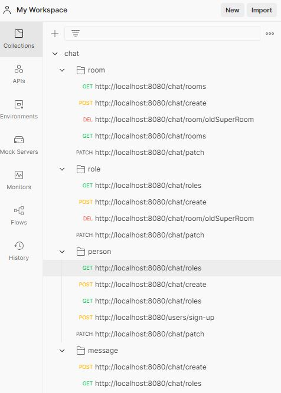

# job4j_chat
О проекте: тестовое задание по Spring REST + доп материалы по spring

Сборка или установка:
Postman

Как использовать: пока просто смотреть)

Стек технологий: Spring REST, Spring Boot, Spring Data JPA, Spring Security, PostgresSQL

Контакты:https:
//github.com/zweidmitr

Цель:
1. Реализовать REST Api через Spring Boot
2. Сделать четыре модели Person. Role. Room, Message.
3. Приложение должно реализовывать чат c комнатами.
4. Доступы через Spring Security

## Доступ
**/login**

## Роли

**GET /roles** найти все роли

**POST /role** создать роль.

**DELETE /role/{id}** удалить роль.

## Комнаты
/chat

**GET /rooms** найти все комнаты.

**GET /room/{name}/** найти комнату по имени.

**POST /admin/room** создать комнату.

**DELETE /admin/room/{id}** удалить комнату.

## Пользователи
/chat

**POST /persons/sign-up** создать пользователя.

**GET /persons найти** всех пользователей.

**GET /persons/{id}** найти пользователя по айди.

**GET /room/{room}/people** найти всех пользователей в комнате.

## Сообщения
/chat

**GET /room/{room}/people** найти все сообщения в заданной комнате.

**POST /room/{nameroom}/{username}/answer** добавить сообщение в комнату.

